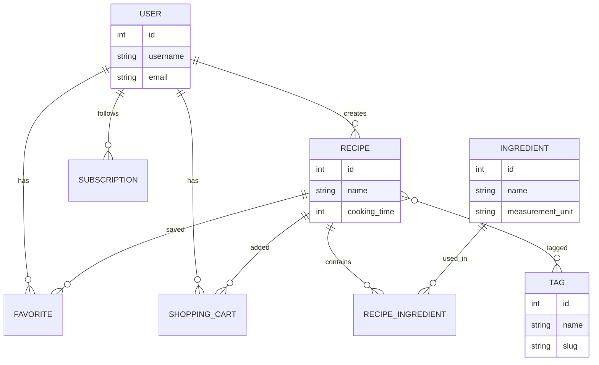

# Описание.
# Foodgram

Backend API для сервиса публикации рецептов.

Пользователи могут:
- создавать рецепты;
- подписываться на авторов;
- добавлять рецепты в избранное;
- формировать список покупок.
## Проект реализует API на базе **Django rest_framework**.
## Архитектура проекта

Проект построен по принципу разделения ответственности:

- users — управление пользователями
- recipes — рецепты и ингредиенты
- subscriptions — подписки на авторов
- favorites — избранное
- shopping_cart — список покупок

Клиент взаимодействует с REST API.
API работает через Django REST Framework.
Данные хранятся в PostgreSQL.

Проект построен на Django REST Framework и использует многослойную архитектуру.
```
Client
   │
   ▼
Django REST Framework
   │
   ▼
Views / ViewSets
   │
   ▼
Serializers
   │
   ▼
Models
   │
   ▼
PostgreSQL
```
## Основные компоненты:

API слой на Django REST Framework;
сериализаторы для валидации и преобразования данных;
ORM Django для работы с базой данных;
PostgreSQL для хранения данных;
Docker для контейнеризации приложения.

## Основные сущности
## ER Diagram



# Установка. 
## Следуйте следующим команда для установки и развертывание проекта у себя локально 
### Клонировать репозиторий и перейти в него в командной строке:
```
git clone https://github.com/Sava151/foodgram
```
```
cd foodgram/
```
### Cоздать и активировать виртуальное окружение:
#### Рекомендуется использовать python 3.9
```
py -3.9 -m venv venv
```
```
source venv/Scripts/activate
```
#### Уточнение имеющихся версий python 
```
py -0
```
#### Уточнение версии по умолчанию
```
python --version 
```
### Установить зависимости из файла requirements.txt
```
pip install -r requirements.txt
```
### Выполнить миграции
```
python manage.py migrate
```
### Запустить проект
```
python manage.py runserver
```

## Технологический стек

- Python 3.12
- Django
- Django REST Framework
- PostgreSQL
- Docker
- Nginx
- Gunicorn
- JWT (Djoser + SimpleJWT)

### Об авторе
[Sava151](https://github.com/Sava151)
